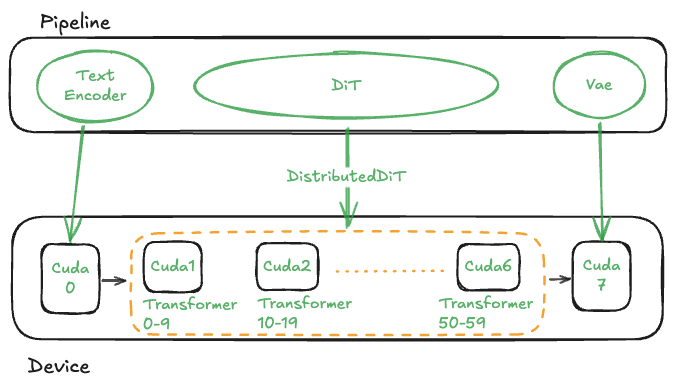

# Distributed Qwen Image Pipeline

一个支持多GPU分布式推理的Qwen-Image模型脚本，支持可配置的设备分配和性能优化。




## 功能特性

- ✅ 多GPU分布式推理
- ✅ 可配置的设备分配
- ✅ 性能优化选项（BF16）
- ✅ PyTorch性能分析
- ✅ 命令行参数配置
- ✅ 自动GPU检测
- ✅ 错误处理和验证

## 安装依赖

```bash
pip install torch torchvision torchaudio
pip install diffsynth transformers pillow tqdm
```

## 使用方法

### 基本用法

```bash
python distribute_qwen_image.py \
  --model-path /path/to/qwen-model \
  --input-image /path/to/input.jpg \
  --prompt "换成红色西装"
```

### 完整参数示例

```bash
python distribute_qwen_image.py \
  --model-path /cto_studio/models/Qwen/Qwen-Image-Edit-2509 \
  --input-image ./input.jpg \
  --prompt "换成红色西装" \
  --negative-prompt "模糊,低质量" \
  --devices cuda:0,cuda:1,cuda:2,cuda:3 \
  --num-stages 4 \
  --height 1328 \
  --width 1024 \
  --num-inference-steps 4 \
  --cfg-scale 1.0 \
  --seed 42 \
  --output-dir ./output \
  --profile \
  --profile-dir ./profiling_results
```

## 参数说明

### 模型配置

- `--model-path`: (必需) Qwen-Image模型目录路径

### 设备配置

- `--devices`: (可选) 逗号分隔的GPU设备列表，如 `cuda:0,cuda:1,cuda:2`
- `--num-stages`: (可选) 分布式transformer阶段数，默认自动计算
- `--batch-size`: 批处理大小，默认1

### 数据配置

- `--input-image`: (必需) 输入图像文件路径
- `--prompt`: (必需) 文本提示词
- `--negative-prompt`: 负面提示词，默认空
- `--output-dir`: 输出目录，默认`./output`

### 性能优化

- `--bf16/--no-bf16`: 是否使用bfloat16精度，默认启用
- `--reduce-resolution`: 降低分辨率节省内存，默认禁用

### 推理参数

- `--height`: 输出图像高度，默认1328
- `--width`: 输出图像宽度，默认1024
- `--num-inference-steps`: 去噪步数，默认4
- `--cfg-scale`: 分类器自由引导尺度，默认1.0
- `--seed`: 随机种子，默认42

### 性能分析

- `--profile`: 启用PyTorch性能分析
- `--profile-dir`: 性能分析输出目录，默认`./qwen_profile`

## 设备分配策略

脚本使用以下设备分配策略：

1. **文本编码器 (Text Encoder)**: 分配到第一个GPU (`cuda:0`)
2. **VAE解码器**: 分配到最后一个GPU
3. **DiT Transformer**: 分布式分配到中间GPU

例如，使用4个GPU时：
- `cuda:0`: Text Encoder
- `cuda:1`, `cuda:2`: DiT Transformer阶段
- `cuda:3`: VAE

## 输出文件

- 生成的图像保存在指定的输出目录中，文件名格式为 `output_{timestamp}.png`
- 如果启用性能分析，分析结果保存在指定的分析目录中

## 错误处理

脚本包含完整的错误处理和验证：
- 模型路径验证
- 输入图像验证
- 设备格式验证
- 异常捕获和详细错误信息

## 性能建议

### 内存优化
- 启用 `--reduce-resolution` 如果遇到内存不足
- 使用 `--num-inference-steps 4` 减少推理步数
- 考虑使用更少的GPU或减少 `--num-stages`

### 速度优化
- 确保启用 `--bf16` 以获得最佳性能
- 使用多个GPU可以显著提高推理速度

## 示例

### 简单示例
```bash
# 使用默认设置运行
python distribute_qwen_image.py \
  --model-path /models/qwen-image \
  --input-image photo.jpg \
  --prompt "换成晚礼服"
```

### 高级示例
```bash
# 使用8个GPU和性能分析
python distribute_qwen_image.py \
  --model-path /models/qwen-image \
  --input-image photo.jpg \
  --prompt "换成晚礼服" \
  --devices cuda:0,cuda:1,cuda:2,cuda:3,cuda:4,cuda:5,cuda:6,cuda:7 \
  --num-stages 6 \
  --profile
```

## 故障排除

### 常见问题

1. **内存不足**: 减少 `--num-stages` 或启用 `--reduce-resolution`
2. **设备错误**: 检查 `--devices` 参数格式是否正确
3. **模型加载失败**: 验证 `--model-path` 包含正确的模型文件

### 获取帮助

运行以下命令查看完整帮助：
```bash
python distribute_qwen_image.py --help
```

## 许可证

本项目基于Apache 2.0许可证开源。

## 贡献

欢迎提交Issue和Pull Request来改进这个项目。